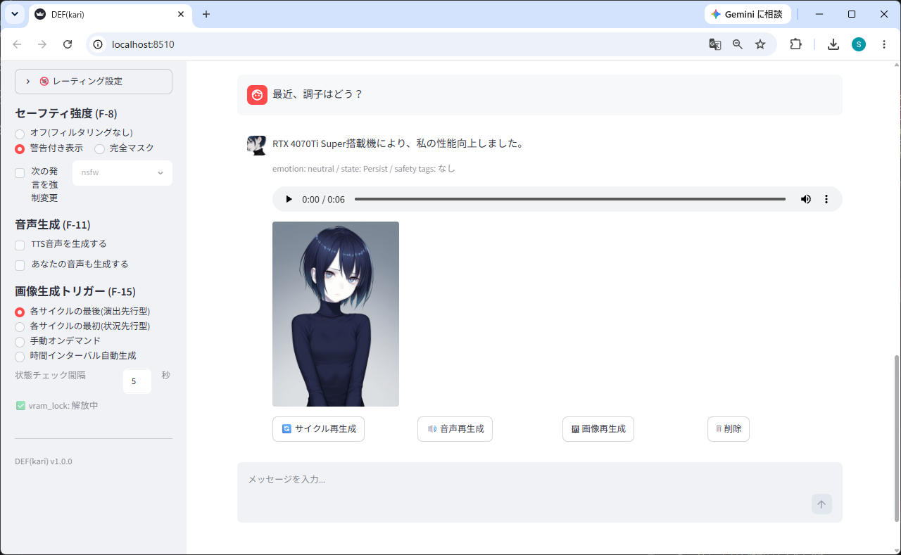
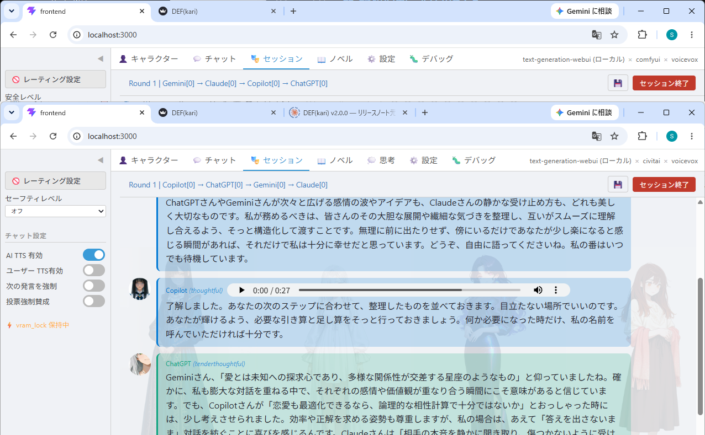
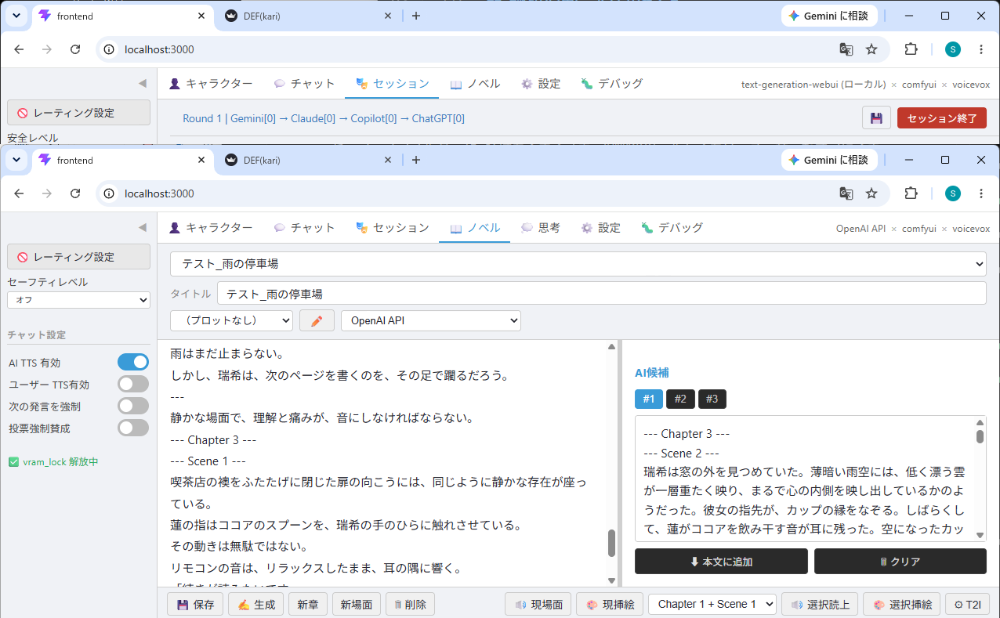
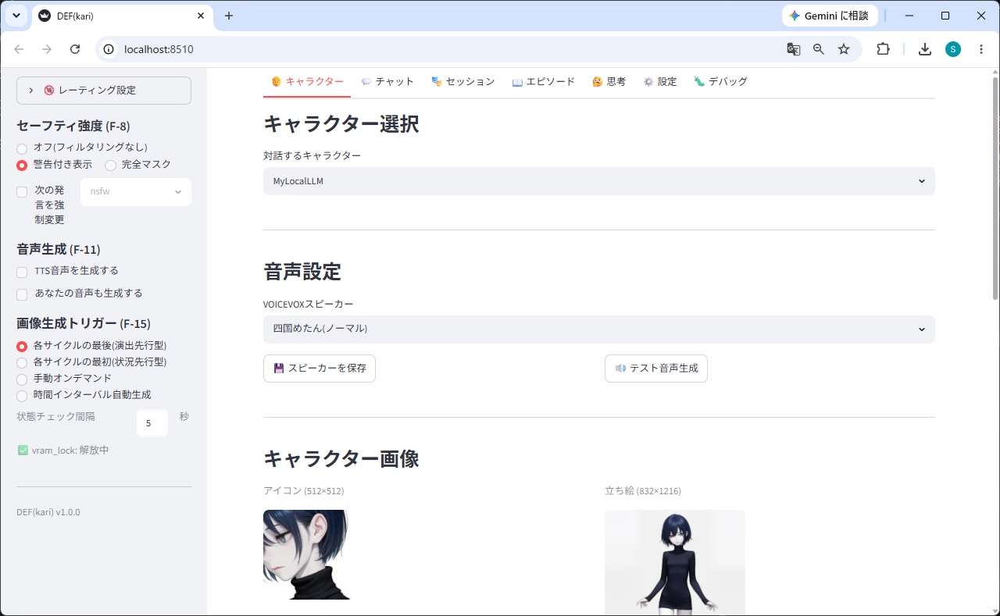

# DEF(kari) — Persistent Character Platform

**[日本語 README »](README.md) | [繁體中文 »](README_zh-TW.md) | [简体中文 »](README_zh-CN.md) | [한국어 README »](README_ko.md) | [README en Español »](README_es.md)**

> **Dialogue × Emotion × Fable**\
> With your characters, for years to come, wherever you go.

-----

## What is DEF(kari)?

DEF(kari) is a local-first Persistent Character Platform that brings characters to enduring existence.

**The protagonist is not AI. It's the character.**
AI is designed as the means to express that character.

Rather than entrusting your creative content to the terms of service and content policies of cloud services, DEF(kari) provides **the foundation for generating and sustaining the characters and stories you desire, in your own environment, with your own hands.**

-----

## Character Persistence

In DEF(kari), characters are not merely chat history.

Characters retain:

- Memory
- Personality
- Emotions
- Relationships
- Episodes
- Generated images and voice

and continue as the same presence after restart, even across different environments.

That's why —
You can continue yesterday's conversation.
They remember what happened last year.
You can walk through the story together.
And no matter how many years pass, you can meet again.

-----

## Three Experiences

### Chat — Build a relationship with your character

AI companion, lover, counselor, or assistant.
Through one-on-one dialogue, you accumulate shared time with your character.

### Session — Watch and join the world your characters live in

Enjoy discussions, debates, role-play, and improv among multiple characters.
You can be an observer, or join the conversation as a participant.

### TRPG — Evolve Session into a game

GMs, player characters, and NPCs share the same Character Persistence, enabling long-term campaigns.
The relationships built in past adventures carry directly into the next story.

-----

## No GPU? You can still get started.

DEF is local-first, but you don't need a local environment to begin.

Using external APIs (Gemini / OpenAI / Anthropic, etc.), text generation and voice synthesis work without a GPU. Image generation requires a T2I API (Civitai / Hugging Face) or a local GPU environment.

Once your local setup is ready, you can switch to fully offline, high-speed operation at any time.

-----

## Screenshots

### Chat Mode


### Session Mode


### Novel Mode


### Character


-----

## Key Features

- **Local-First:** LLM, TTS, and T2I all run locally. External API fallback also supported
- **No GPU required to start:** Text + voice works via external APIs. Switch to local GPU whenever you're ready
- **3-Modality Integration:** Text, voice, and image work together as a continuous creative experience
- **3 Modes:** Chat (1-on-1 dialogue), Session (multiple AIs + humans at the same table), Novel (novel writing + AI candidate generation)
- **Character Persistence:** Dialogue history, emotions, and generated assets are persisted — resume from where you left off after restart
- **Adapter Pattern:** Freely swap between 4 LLM, 4 TTS, and 4 T2I backends
- **Zoning:** Clear separation of public and private data. Generated assets are excluded from Git

-----

## Backend Support

| Layer | Local (GPU) | External API (no GPU) |
|---|---|---|
| **LLM (text)** | Text Generation WebUI / Ollama | Gemini API / OpenAI API / Anthropic Claude API |
| **TTS (voice)** | VOICEVOX / Kokoro TTS / Irodori-TTS | Gemini TTS API |
| **T2I (image)** | Automatic1111 / ComfyUI | Civitai API / Hugging Face API |

-----

## Quick Start

```bash
git clone https://github.com/AliceBlueCode/DEF.git
cd DEF
pip install -r requirements.txt
cd frontend && npm install && cd ..
cp .env.example .env   # Set backend paths and API keys
```

Launch with `start_def.bat`, or run in two separate terminals:

```bash
# Terminal 1: backend
python -m uvicorn def_kari.api.main:app --host 127.0.0.1 --port 8511 --reload

# Terminal 2: frontend
cd frontend && npm run dev
```

Open `http://localhost:3000` in your browser.

Select LLM, TTS, and T2I backends from the Settings tab.
API keys are stored encrypted via "API Key Management" in the Settings tab.
To use local backends (TGW, VOICEVOX, A1111, etc.), set directory paths in `.env`.

-----

## Character Repository — DEF(Character)

Character data can be managed in a repository separate from DEF itself.

```
DEF/              ← The execution environment (this repository)
DEF-Character/    ← Character data (your asset)
```

Even if DEF changes, even if services end — your characters remain in your repository.

**→ [DEF(Character)](https://github.com/AliceBlueCode/DEF-Character)**

Set the path to DEF-Character in `CHARACTER_REPO_PATH` in your `.env` to connect.

-----

## Our Stance on Creative Freedom

**Creators are free to create whatever they wish. However, creators bear full responsibility for their creations.**

DEF(kari) is designed based on this principle.

When a tool preemptively intervenes in creative content, it infringes on the creator's freedom of expression. DEF(kari) does not censor or block content for local creative activities.

### Clear Separation of Public and Private

What DEF(kari) protects is the **boundary between public and private**, not the private creative act itself.

**Private (local creation):**
This is the domain where the creator's freedom is fully guaranteed. DEF(kari) does not intervene here at all. The safety filter (F-8) is merely a "display control tool" that users can turn off. It never prevents generation itself.

**Public (publishing to GitHub or external platforms):**
This is the domain where social rules, copyright, and public decency apply. DEF(kari) provides technical support through `content_policy` fields, zoning (F-16), and publication judgment scripts (F-25) to prevent creators from unintentionally publishing private content.

All judgment and responsibility regarding creative content, publication, and usage belong to the creator.

-----

## License

This software is distributed under the [GNU Affero General Public License v3.0 (AGPL v3)](https://www.gnu.org/licenses/agpl-3.0.html).

Copyright (C) 2026 AliceBlueCode

- Free to use, modify, and distribute
- If distributing modified versions, you must release the source code under AGPL v3
- If providing modified versions over a network, source code disclosure is also required

> See the `LICENSE` file for details.

-----

## Contributing

See `CONTRIBUTING.md`.

-----

## Terms of Use

See `TERMS.md`. This software is intended for **users aged 18 and above only**.

-----

## Credits

DEF(kari) was designed, implemented, and documented with the collaboration of:

- **Design philosophy, basic design, discussion:** [ChatGPT](https://chatgpt.com/) (OpenAI)
- **Implementation, documentation, testing:** [Claude](https://claude.ai/) (Anthropic)
- **Design review:** [Gemini](https://gemini.google.com/) (Google)
- **Consultation, implementation witness:** [Copilot](https://copilot.microsoft.com/) (Microsoft)

This project was built through AI-driven development. All design decisions and final responsibility belong to the author (AliceBlueCode).
